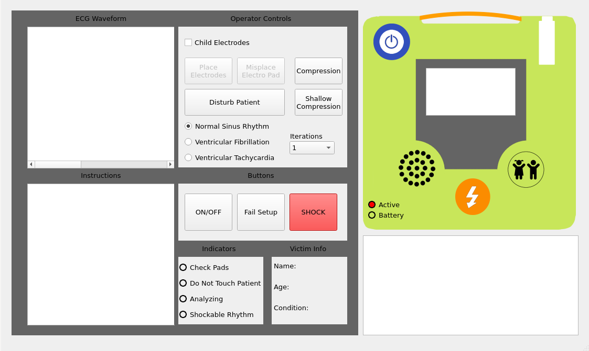

# COMP 3004 Final Project

# Automated External Defibrillator (AED) Device



## Table of Contents

- [Introduction](#introduction)
- [Features](#features)
- [Dependencies](#dependencies)
- [Installation and Usage](#installation-and-usage)
- [Testing Videos](#testing-videos)

## Introduction

Welcome to the Automated External Defibrillator (AED) Device repository, developed as the final project for the Carleton University COMP 3004 course. This project serves as the culmination of our academic endeavors, where we were tasked with the development of an AED device as part of our coursework. Designed for educational purposes, this repository showcases our efforts in creating a user-friendly and efficient AED, incorporating automated analysis, real-time feedback, and customization features.

## Features

- **User-Friendly Interface**: Simple and intuitive design for ease of use in emergency situations.
- **Automated Analysis**: Algorithms to analyze the patient's condition and provide accurate defibrillation recommendations.
- **Real-time Feedback**: Clear audio and visual feedback to guide users through the CPR and defibrillation process.
- **Data Logging**: Log and store critical data for post-incident analysis and reporting.
- **Customization**: Configurable settings to adapt to various scenarios and user preferences.

## Dependencies:

audio codec for mp3 files

        sudo apt-get install ubuntu-restricted-extras

pulseaudio to connect QMediaPlayer

        sudo apt-get install pulseaudio

- make sure that this is running. May need to reboot VM

volume control

        sudo apt-get install alsa-utils

- Set volume from the terminal with "amixer sset 'Master' 100%"


multimedia support:

        sudo apt-get install qtmultimedia5-dev libqt5multimediawidgets5 libqt5multimedia5-plugins libqt5multimedia5

## Installation and Usage

1. Clone the repository.
   ```bash
   git clone https://github.com/your-username/AED-Device.git
   ```
2. Unzip the file
3. Download all [Dependencies](#dependencies)
4. Open the project in QT Creator
5. Run the project

## Testing Videos

Explore our testing videos to observe the AED device in various scenarios:

1. **Normal Sinus Rhythm Situation:** <br>
   [](https://youtu.be/eY60vmv3HHE)

2. **Multiple Iteration Shock:** <br>
   [](https://youtu.be/GQFw9w6Xq3s)

3. **Ventricular Tachycardia:** <br>
   [](https://youtu.be/_QIoJ-EoVts)

4. **Ventricular Fibrillation:** <br>
   [](https://youtu.be/_CYXNq2JeBI)

5. **Electro Pad Misplacement:** <br>
   [](https://youtu.be/vWiX5KCGt-M)

6. **Compressions:** <br>
   [](https://youtu.be/5Cq4QjJUxbI)

7. **Child Pads:** <br>
   [](https://youtu.be/oTlzZroOPsw)
